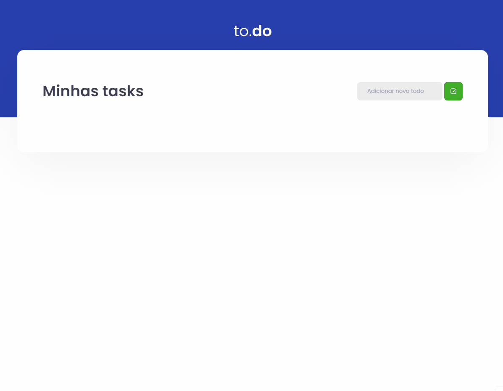

<h1 align="center"></h1>

<h3 align="center">ToDo List</h3>

<p align="center">“O que sabemos é uma gota. O que ignoramos é um oceano.”</p>

<p align="center">
  <a href="#about">Sobre</a>&nbsp;&nbsp;&nbsp;|&nbsp;&nbsp;&nbsp;
  <a href="#install">Instalação</a>&nbsp;&nbsp;&nbsp;|&nbsp;&nbsp;&nbsp;
  <a href="#challenge">Desafios</a>&nbsp;&nbsp;&nbsp;|&nbsp;&nbsp;&nbsp;
  <a href="#technologies">Tecnologias</a>
</p>

## :speech_balloon: Sobre <a name="about"></a>

> Desafio principal da trilha de React do Ignite.

<br />
<table>
  <tr>
    <td colspan="1">Desktop</td>
  </tr>
  <tr>
    <td></td></td>
  </tr>
</table>

## :warning: Instalação <a name="install"></a>

```bash
# Instalar as dependências necessárias:
$ yarn

# Iniciar o projeto:
$ yarn dev

# Realizar testes:
$ yarn test
```

## :triangular_flag_on_post: Desafio <a name="challenge"></a>

> Aprender a manipular o Hook `useState`:
>
> - Crie uma nova task com um id random. Não permita criar caso o título seja vazio.
> - Altere entre `true` ou `false` o campo `isComplete` de uma task com dado id.
> - Remova uma task da listagem pelo id.

## :heavy_check_mark: Tecnologias <a name="technologies"></a>

- [React](https://pt-br.reactjs.org/)
- [JavaScript](https://developer.mozilla.org/pt-BR/docs/Web/JavaScript)
- [TypeScript](https://www.typescriptlang.org/)

---

by [Douglas Scaini](https://www.github.com/douglasscaini) ❤️
